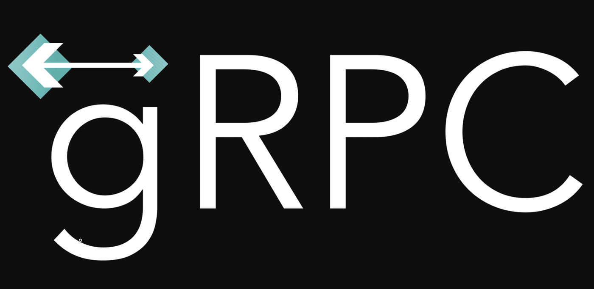

# Hi there, I'm Artem  
### Golang Backend Developer  

- 🌱 I’m currently learning **Go, Web**

- 📫 How to reach me **@chas3air**

- 🌍 I speak Russian (native), English (B1)

<picture>
  
</picture>

### Connect with me:

  

## 🛠️ Stack
### **Languages:**

  
  
  
  

### **Databases:**

  
  
  
  
  

### **APIs & Communication**

  
  
  

### **Infrastructure & DevOps**

    
  
  

### **Monitoring & Observability**

  
  

